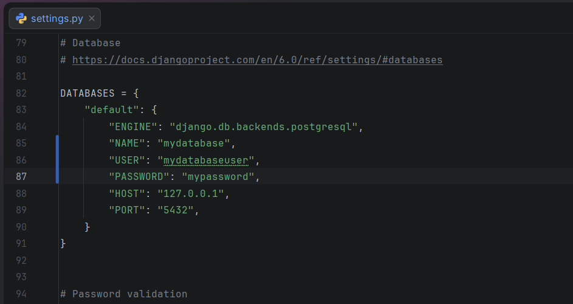

# Documentation

---
### Project OverView
In a world where cats use computers, **Cat Mood Diary** is a Django web application that allows cats to track 
their daily moods, activities, and personal diary notes in a 
structured and interactive way.

The application is developed as an individual project for the Django 
Basics course at SoftUni and demonstrates core Django concepts including:

- MTV architecture (Model-Template-View)
- Class-Based Views (CBVs)
- Model relationships (ForeignKey & ManyToMany)
- Forms and validation
- Media file handling
- Filtering, pagination and template logic
- PostgreSQL database integration

---
### Project Purpose

The goal of this project is to demonstrate understanding of Django fundamentals by:

1. Designing a structured database with relationships
2. Implementing full CRUD functionality
3. Applying model-level and form-level validation
4. Using reusable templates and partials
5. Maintaining clean and modular architecture
6. Following best practices for Django applications

---

## Project Setup Instructions
To run this project ypu will need:
- Python 3.12
- pillow for media files
- psycopg2-binary
- PostgreSQL database

### Setup Guide
1️⃣ Clone the repository
```bash
git clone <repository-url>
cd <repository-directory>
```

2️⃣ Create virtual environment
```bash
python -m venv .venv

# For Mac/Linux
source .venv/bin/activate

# For Windows
.\.venv\Scripts\activate
```

3️⃣ Install dependencies
```bash
pip install -r requirements.txt
```

4️⃣ Configure PostgreSQL database

*Create a PostgreSQL database and configure your database settings inside:*
```
cat_diary/settings.py
```
*It should look like this:*


5️⃣ Apply migrations to your database
```bash
python manage.py migrate
```

6️⃣ After migrating, load demo data

*The project includes a prepared data fixture*
```bash
python manage.py loaddata fixtures/initial_data.json
```
This will populate:
- Cats
- Activities
- Mood entries

▶️ Running the project
```bash
python manage.py runserver
```
After successfully running the server, open in your browser:
```
http://127.0.0.1:8000/
```

---

## Application Structure
The project consists of four Django apps:

### ✅ Cats
*Manages cat profiles, including:*
- Name
- Birthdate
- Personality 
- Profile photo 
- Automatic creation timestamp

### ✅ Moods
*Handles daily diary entries:*
- Name
- Birthdate 
- Personality 
- Profile photo 
- Automatic creation timestamp

### ✅ Activities
*Defines possible activities that cats can perform:*
- Categorized activity types 
- Energy cost level 
- Description 
- Automatic creation timestamp 
- Ordered by most recent

### ✅ Common
*For shared components:*
- Custom template tags 
- Reusable pagination template 
- Shared choices (EnergyChoices)

---

## Database Design
#### 📍 Models used:
1. Cat
2. MoodEntry
3. Activity

#### 📍 Relationships:
- One-to-Many:
  - A cat can have multiple MoodEntries.
- Many-to-Many:
  - A MoodEntry can include multiple Activities
- Unique Constraint:
  - A cat cannot create two diary entries for the same date.

#### 📍 Forms & Validation
*The project includes multiple ModelForms with:*
- Custom labels and help texts 
- Custom validation messages 
- Field-level validation 
- Form-level validation 
- Model-level date validator 
- Disabled fields in update forms 
- Confirmation step before deleting objects

*Some validation includes:*
- Custom labels and help texts 
- Custom validation messages 
- Field-level validation 
- Form-level validation 
- Model-level date validator 
- Disabled fields in update forms 
- Confirmation step before deleting objects

